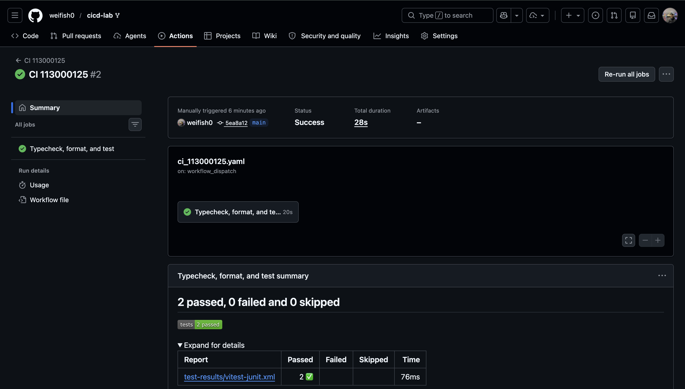
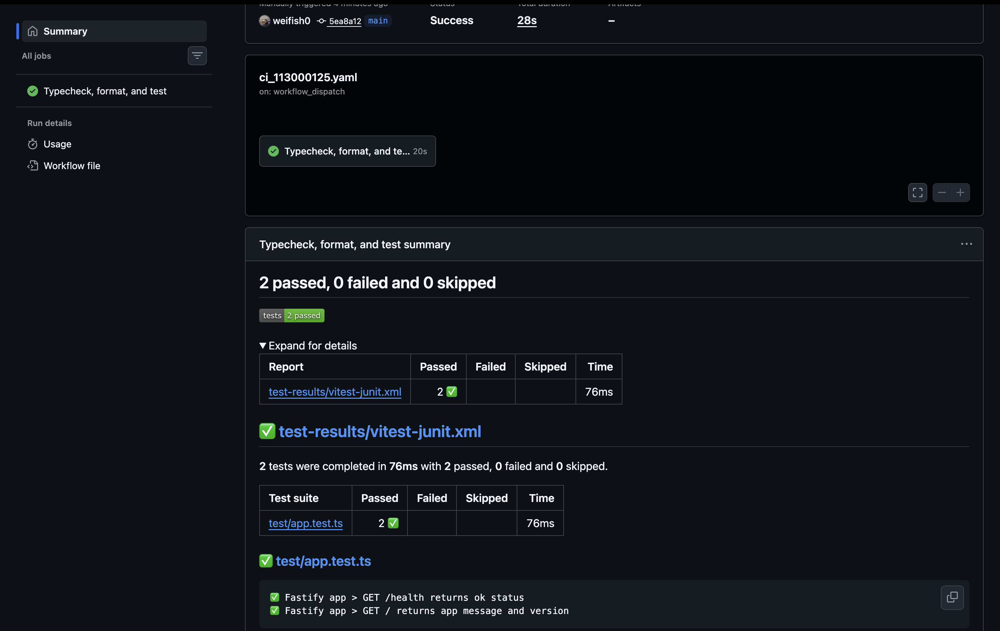
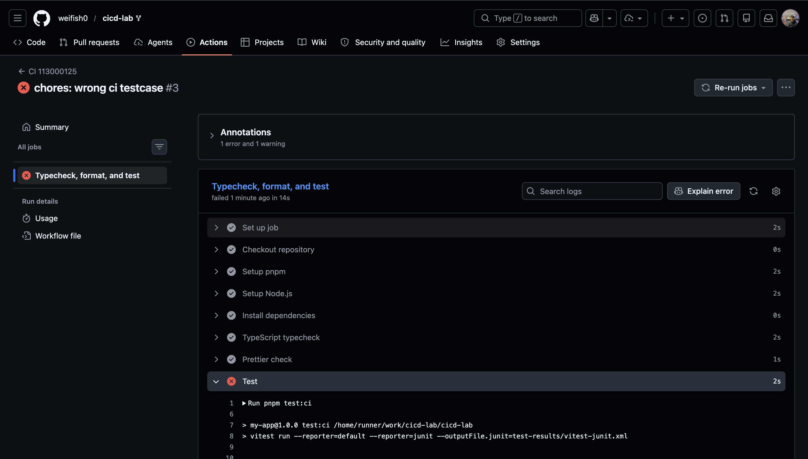
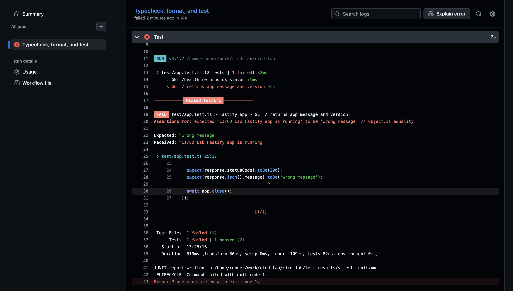

# CI Pipeline 報告

## CI Pipeline 說明

本專案新增 `.github/workflows/ci_113000125.yaml`，讓 GitHub Actions 在每次 `push` 到任意分支時自動執行 CI pipeline。另外也保留 `workflow_dispatch`，方便需要截圖或重新驗證時手動執行。

Pipeline 使用 `pnpm` 安裝依賴，並依序執行以下檢查：

1. TypeScript typecheck：執行 `pnpm typecheck`，確認 TypeScript 型別正確。
2. Prettier check：執行 `pnpm format:check`，確認程式碼格式符合 Prettier 規則。
3. Test：執行 `pnpm test:ci` 跑 Vitest 測試，並輸出 JUnit XML 測試報告。
4. Publish test results：使用 `dorny/test-reporter@v2` 讀取 JUnit XML，將測試結果顯示在 GitHub Actions 的結果頁面。

GitHub Actions 預設會在任一 step 回傳非 0 exit code 時將 job 標記為失敗，因此 TypeScript typecheck、Prettier check 或 Test 任一項失敗時，整個 pipeline 都會顯示 failed。

## `.github/workflows/ci_113000125.yaml` 主要內容

```yaml
name: CI 113000125

on:
  push:
    branches:
      - '**'
  workflow_dispatch:

permissions:
  contents: read
  checks: write

jobs:
  ci:
    name: Typecheck, format, and test
    runs-on: ubuntu-latest

    steps:
      - name: Checkout repository
        uses: actions/checkout@v5

      - name: Setup pnpm
        uses: pnpm/action-setup@v4
        with:
          version: 10

      - name: Setup Node.js
        uses: actions/setup-node@v5
        with:
          node-version: 22
          cache: pnpm

      - name: Install dependencies
        run: pnpm install --frozen-lockfile

      - name: TypeScript typecheck
        run: pnpm typecheck

      - name: Prettier check
        run: pnpm format:check

      - name: Test
        run: pnpm test:ci

      - name: Publish test results
        if: always()
        uses: dorny/test-reporter@v2
        with:
          name: Vitest test results
          path: test-results/vitest-junit.xml
          reporter: java-junit
          fail-on-error: false
          fail-on-empty: false
```

## 設計方式與使用工具

本次 CI 採用單一 job，讓檢查流程簡單清楚，便於在 GitHub Actions 頁面追蹤失敗原因。

- `actions/checkout@v5`：下載 repository 內容。
- `pnpm/action-setup@v4`：安裝 pnpm。
- `actions/setup-node@v5`：安裝 Node.js 22，並啟用 pnpm cache。
- `pnpm install --frozen-lockfile`：依照 `pnpm-lock.yaml` 安裝固定版本依賴。
- `pnpm typecheck`：執行 TypeScript 型別檢查。
- `pnpm format:check`：執行 Prettier 格式檢查。
- `pnpm test:ci`：執行 Vitest，並產生 JUnit XML 測試結果。
- `dorny/test-reporter@v2`：將 JUnit XML 測試結果顯示於 GitHub Actions 結果頁面。

`Publish test results` step 使用 `if: always()`，即使測試失敗也會嘗試發布測試結果，方便在 Actions 頁面看到失敗的 test case。這個 step 設定 `fail-on-error: false` 與 `fail-on-empty: false`，避免測試報告發布工具本身覆蓋原本的 typecheck、format 或 test 失敗原因。

## CI 執行結果截圖

### 成功執行截圖



### GitHub Actions 結果頁面



## 失敗案例說明

暫時將 `test/app.test.ts` 中首頁訊息的期望值改成錯誤文字：

```ts
expect(response.json().message).toBe('wrong message');
```

原本 API 回傳的內容是：

```ts
'CI/CD Lab Fastify app is running';
```

因此 Vitest 會判定實際值與期望值不同，`pnpm test:ci` 會回傳非 0 exit code，GitHub Actions pipeline 會顯示 failed。修正方式是把測試期望值改回正確文字，或在真的有需求變更時同步修改 source code 與 test。

### 失敗執行截圖



### 失敗原因截圖


